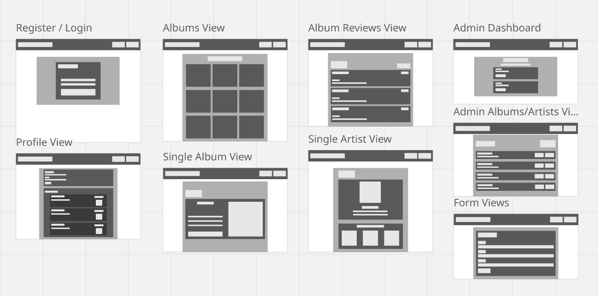

### Overview ###
This is a front-end Vue application that allows users to leave reviews on selected albums from the database. The user can also view reviews made my other users, as well as details on an album or artist. The admin can add and remove artists and albums from the database. 

### Structure ###

## Views
- AlbumsView - Main album listing page (public access)
- AlbumView - Individual album details with reviews
- ArtistView - Artist profile with discography
- ReviewsView - Album reviews display
- ReviewFormView - Create/edit review form
- ProfileView - User profile and collection
- Login/Register views - Authentication forms

## Components
- UI components from shadcn/ui
- FormField - Reusable form input wrapper
- NavButton - Navigation link component
- Review - Used for the Reviews view. Displays review details 
- Album - Used for the Albums view. Displays a clickable album cover
- AdminAlbum - Used for the AdminAlbums view. 
- AdminArtist - Used for the ArtistAlbums viewactions.

## Admin Views
- AdminAlbums - Displays album details with CRUD routes
- AdminArtists - Displays artist details with CRUD routes
- AlbumForm - Form for creating or editing albums
- ArtistForm - Form for creating or editing artists
- Dashboard - Admin overview page

### State Management ###

## Authentication Store
- User authentication state (isLoggedIn)
- Role-based permissions (user/admin)

### Routing Structure ###

## Public Routes (no authentication required)
- `/` - Albums page
- `/albums/:id` - Single Album details page
- `/artists/:id` - Single Artist details page
- `/reviews/:id` - Reviews for single album

## Protected Routes (authentication required)
- `/profile` - User profile page
- `/reviews/form/:id/:reviewId?` - User Review form page

## Admin Routes (admin authentication required)
- `/admin` - Admin dashboard page
- `/admin/albums` - Admin Album page
- `/admin/artists` - Admin Artist page
- `/admin/albums/:albumId?` - Admin Album form page
- `/admin/artists/:artistId` - Admin Artist form page

### API Integration ###
- The frontend uses a backend API, which is ran on `http://localhost:3000/api`
- Discogs API search endpoint used to grab images for album covers and artist profiles

### Design System ###
- Tailwind CSS
- shadcn/ui component library

### Wireframe ###

### Form Validation ###
- Toast notifications for user actions
- Zod schemas for data-type validation
- Real-time validation feedback

### Testing ###

## Unit Testing
- Unit testing with Vitest
- Service layer testing for API integration
- Utility function testing

## End-to-End Testing
- E2E testing with Playwright
- User journey testing (login, review creation, etc.)
- Cross-browser compatibility testing